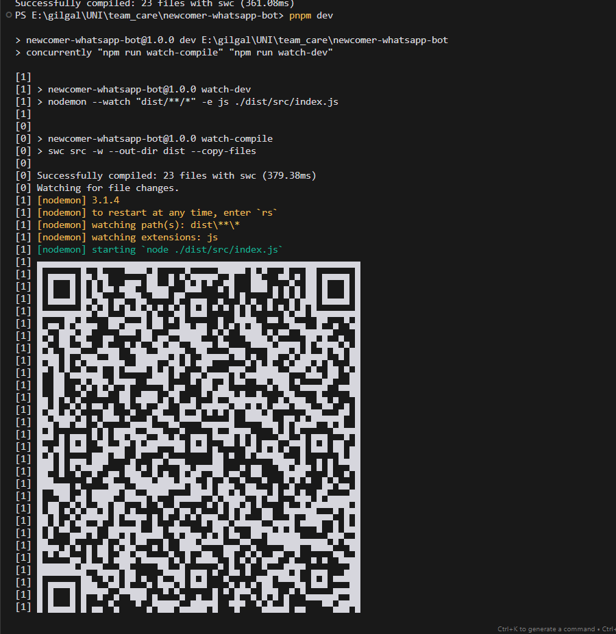
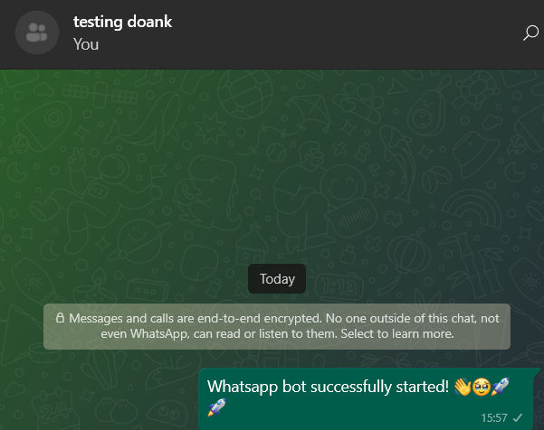
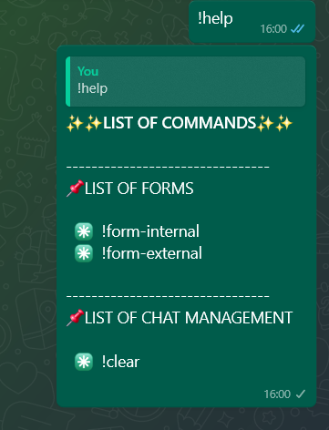

# newcomer-whatsapp-bot

Welcome! **newcomer-whatsapp-bot** is a project to lighten the work of the author's church (shoutout: GILGAL Centre Jakarta) community volunteers in managing newcomers, which usually inserted by third party form. Leveraging **whatsapp-web.js** to interact with this application and **google sheets** as a database. 

## Inspirations💡

Inspirations that leads the author to developing this project 🚀✨

- 🔥 [vinibgoulart/wpp-sheets-party-list](https://github.com/vinibgoulart/wpp-sheets-party-list/)
- Random tutorials on *youtube* using **autoreplychatbot** and **Google AppsScript** WHICH the author is trying to avoid because it has so many drawbacks such as the **autoreplychatbot** has to be running all the time on our phone.

## Tech Stack 🛠️

Here are the technology that this project uses

- NodeJS
- Typescript

Notable libraries

- whatsapp-web.js
- googleapis 

## Installation 🪛

1. Clone the project  either by **downloading the zip file** from Github or by using this command in your project directory.

```git
git clone http://url.git
```

> make sure you have [Git](https://git-scm.com/) installed on your machine.
> Also make sure to have [NodeJS](https://nodejs.org/en) installed.

2. Open the folder in your terminal of choice e.g. cmd or gitbash.

3. After you successfully cloned the project, install **node_modules** using your installed package manager. In this case we're using **npm** ([npmjs.com](npmjs.com)).

```bash
npm install
```

## Running The Project 🚀

1. Make sure you have a **Google Cloud Services** account. Select "**APIs and services**", then create a **Service Account**. Make sure you have the email created by Google Cloud Services and set the email address as an editor in the google sheets file you want to use.

2. Make sure you have downloaded the **service account credentials** from **Google Cloud Console**. Create a new file and name it **.env**, then duplicate the content of **.env.example** file into the .env. Copy the value of every key into the corresponding key in the **.env** file you just created. 

3. The project currently only allow messages from WhatsApp group chats to fire events. The group chat name is hardcoded in `src\services\whatsAppWeb\api\onMessageEvents\index.ts` and `src\services\whatsAppWeb\api\authentication\onReady.ts`. Make sure the group chat name is the same as the one you're using.

4. The project currently only allow inserts to google sheet that has this table format:

|newcomerId|nama|tanggalLahir|alamat|
|----------|----|------------|------|
|UNI00001|name|birthDate|address|

5. Run the project using the following command. We're using pnpm that was installed when we executed npm install.

```bash
pnpm run dev
```

6. A qr code will appear in the terminal when we run the project. Scan the qr with WhatsApp qr scanner to allow the applicatioon to log in to WhatsAppWeb. The application will log "WAWeb connected successfully" or anything similar to indicate that the WAWeb client is connected.



> The application will also notify the group chat you're using that the application is ready.
> 

## Usage

- The application replies with a list of commands when the author send a message with the content "!help".



## Improvements


- [x] Put the hardcoded group name in .env to ease configuration. 
- [ ] Add a logger.
- [ ] The data inserted to Google Sheet by this application is not the exact data the church volunteers need. As of today (16 August 2024), this project is still a prototype.


- Feature wishlist:
  - [ ] Add a command to mention everyone in the group.
  - [ ] Add a command to download the google sheet file in use.

## Notes

- This project is still in development and is constantly updated.
- Thankful for the opportunity, the support, ideas, inspiration, and love that God put in me through people and the internet 😂. Thank you!

## License

MIT License

Copyright (c) 2024 Stefan Dharmawan Cakrasaputra

Permission is hereby granted, free of charge, to any person obtaining a copy
of this software and associated documentation files (the "Software"), to deal
in the Software without restriction, including without limitation the rights
to use, copy, modify, merge, publish, distribute, sublicense, and/or sell
copies of the Software, and to permit persons to whom the Software is
furnished to do so, subject to the following conditions:

The above copyright notice and this permission notice shall be included in all
copies or substantial portions of the Software.

THE SOFTWARE IS PROVIDED "AS IS", WITHOUT WARRANTY OF ANY KIND, EXPRESS OR
IMPLIED, INCLUDING BUT NOT LIMITED TO THE WARRANTIES OF MERCHANTABILITY,
FITNESS FOR A PARTICULAR PURPOSE AND NONINFRINGEMENT. IN NO EVENT SHALL THE
AUTHORS OR COPYRIGHT HOLDERS BE LIABLE FOR ANY CLAIM, DAMAGES OR OTHER
LIABILITY, WHETHER IN AN ACTION OF CONTRACT, TORT OR OTHERWISE, ARISING FROM,
OUT OF OR IN CONNECTION WITH THE SOFTWARE OR THE USE OR OTHER DEALINGS IN THE
SOFTWARE.
